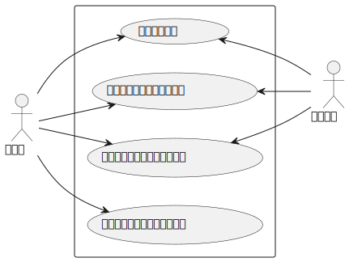

# cognito-sample

Amazon Cognito を使用した認証・認可のサンプルコード  
## ユースケース

## アーキテクチャ


## setup
AWSリソースを作成の上、プロジェクトルートディレクトリに下記を記載した.envファイルを作成
``` :.env
USER_POOL_ID=hoge
AWS_REGION=hoge
COGNITO_CLIENT_ID=hoge
COGNITO_ID_POOL=hoge
BUCKET_NAME=hoge
```

``` bash
npm install
npm run start
```


### 参考
[AWS CLIで動かして学ぶCognito IDプールを利用したAWSの一時クレデンシャルキー発行](https://dev.classmethod.jp/articles/get-aws-temporary-security-credentials-with-cognito-id-pool-by-aws-cli/#toc-13)